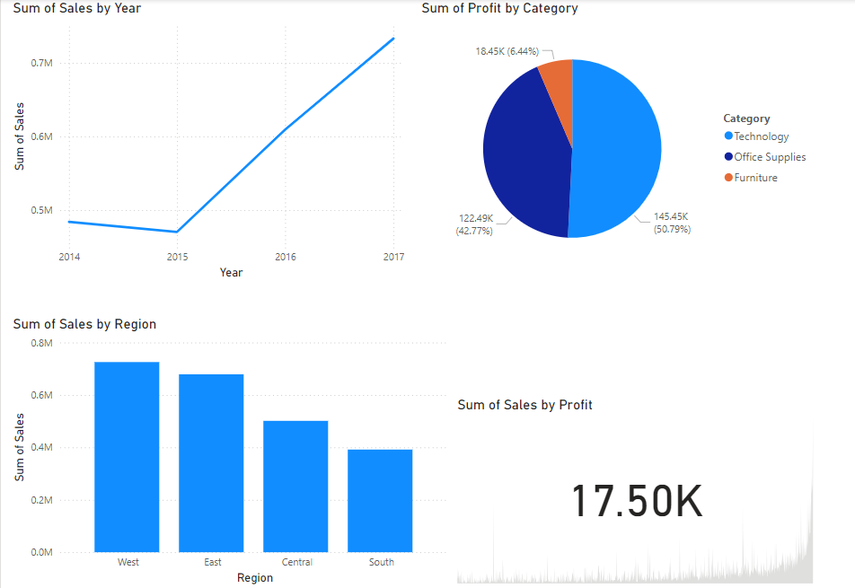

# Sales Performance Analysis and Dashboard Creation

## Objective
Analyze sales data to uncover trends, identify top-performing regions/products, and present findings using an interactive dashboard.

## Tools & Techniques
- **Python**: Pandas, Matplotlib, Seaborn for data cleaning and visualization.
- **Power BI**: Dashboard creation.
- **Dataset**: [Superstore Dataset](https://www.kaggle.com/datasets/vivek468/superstore-dataset-final).

## Key Insights
- There is a steady increase in sales from 2015 to 2017, indicating positive growth over the years.
- The "Technology" category contributes the most profit (50.79%), followed by "Office Supplies" (42.77%)
- The West and East regions lead in sales, while the Central and South regions need improvement.

## Power BI - Dashboard

